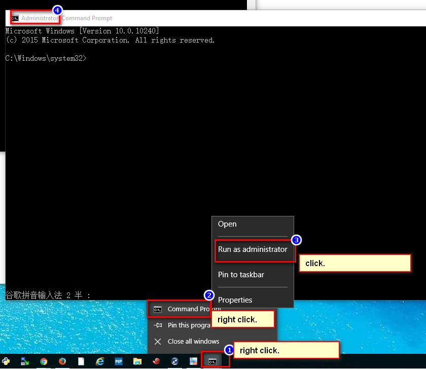

# 奥林岛财务软件在win7/win8/win10安装

## 安装32bit的Office
Office 2007. office 2013、office 2016,office2 019的32bit版本皆可！不可装64bit版本office.

## 下载注册Vsflex6.ocx

  1. 下载vsflex6.ocx <br> 
    **下载链接(下载任意一个即可)** <br> 
     (1). [Vsflex6.zip](https://dllyes.com/wp-content/uploads//OCX/201511071744/Vsflex6.zip)
     
     (2). [Vsflex6.zip](post/file/Vsflex6.zip)
  2. 解压出来的文件`Vsflex6.ocx`，复制粘贴到`c:/windows/system32/`目录。
  3. 管理员权限打开CMD.<br>在如下图所示图标右键。在“CommandPrompt“点击右键。然后在弹出的菜单 ”Run as Administror”，单击打开。
如下图


 4. 复制粘贴并在打开管理员权限cmd里运行这个命令即可完成`Vsflex6.ocx`的注册.

  ```cmd
regsvr32 c:\windows\system32\Vsflex6.ocx
```


--THE END--

